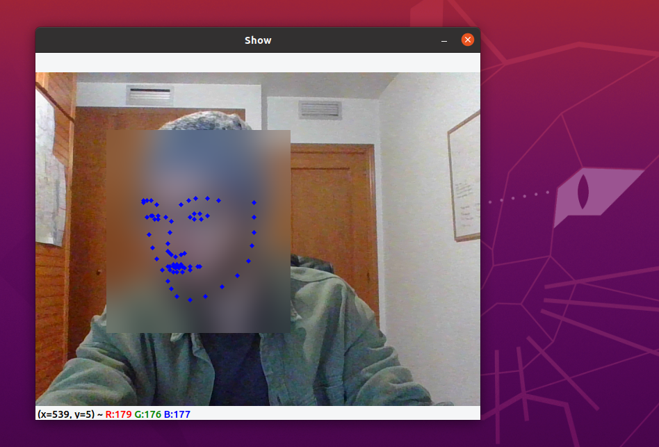

# Face Blur for (webcam) video anonymization

Fast and simple project for anonymization in webcam video.

Video [here](https://www.linkedin.com/feed/update/urn:li:activity:6734394877460660224/).

## Python Package Requirements

- OpenCV
- Numpy
- Face-alignment

## Description

Deep Learning based face anonimizator. 

It detects the user's face, applies some blur to that area and prints their face's keypoints as a digital avatar. As simple as that.

This is just a fun-afternoon-project developed to apply some simple computer vision commands.

## Images

